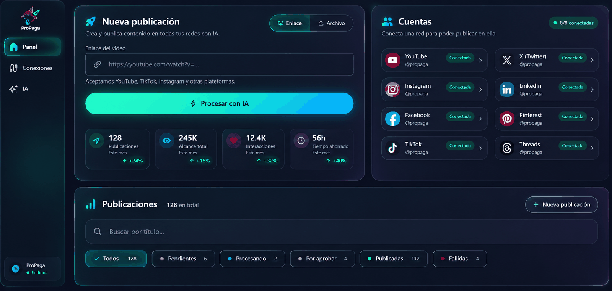

<div align="center">

# PROPAGA

### One video. Five networks. One click.

**Upload a video. AI writes the title, the description and the hashtags.
You approve. It publishes to Facebook, Instagram, YouTube, X and TikTok at once.**

[](https://propaga.lat)


</div>

---

> ## ⚠️ What this repository is
>
> A **curated portfolio snapshot**. Frozen, unmaintained, and **deliberately
> incomplete**. Left out:
>
> | Omitted | Where it's documented |
> |---|---|
> | The **production prompts** of the content generator | [`prompts.py`](apps/publications/prompts.py) — the prompt architecture, layer by layer |
> | The **implementations of the five social integrations** | [`publishers.py`](apps/publications/publishers.py) — each network's protocol, phase by phase |
> | The **error diagnosis table** for those APIs | [`tasks.py`](apps/publications/tasks.py) — the mechanism, with two sample entries |
> | Credentials, tokens and user data | — |
>
> What's omitted isn't the interesting part to read — it's the expensive part to
> reproduce. Everything else is here: the async pipeline design, the data model,
> distributed locking, graceful degradation when third parties fail, incremental
> OAuth, encryption of API keys at rest, the tests and the deployment.
>
> **This code does not build into a product.** See [LICENSE](LICENSE): view-only.

---

## The problem

Publishing the same video to five networks is manual, repetitive and
surprisingly slow work. Not because of the clicks — because of what's underneath:

<table>
<tr><td width="25%"><strong>Five text formats</strong></td>
<td>YouTube takes a 100-character title. X takes 280 characters total. TikTok puts
title and description in a single 2,200-character field. Copy that works on one
reads badly on the other four.</td></tr>

<tr><td><strong>Five codec policies</strong></td>
<td>An <code>.mp4</code> pulled off the internet may carry VP9 or AV1 inside. X rejects
it. You find out through a failed 200 MB upload.</td></tr>

<tr><td><strong>Five upload protocols</strong></td>
<td>YouTube uses resumable upload. X demands four phases over OAuth <strong>1.0a</strong>.
Instagram won't take the file at all: it makes you expose it at a public URL and
poll. TikTok reserves the space before you send a single byte.</td></tr>

<tr><td><strong>And all of that comes after</strong></td>
<td>watching the video, thinking up a title, writing a description and inventing
hashtags.</td></tr>
</table>

The usual outcome: the creator publishes to one network, gets tired, and the
other four never get the content.

## The solution

| The user does | PROPAGA does |
|---|---|
| Pastes a URL or uploads a file | Downloads with yt-dlp, preferring H.264/AAC from the source |
| — | Extracts the audio and transcribes it with Whisper (Groq) |
| — | Writes title, description and hashtags with Gemini, in the configured persona |
| Reviews and edits the copy | Transcodes to the format all five networks accept |
| Picks targets and approves | Publishes to all five and stores each permalink |
| Watches progress step by step | If one network fails, publishes to the rest and explains what happened |

**Seven AI personas** per user — viral, professional, casual, humorous,
educational, inspirational, sales — plus free-form instructions, fixed brand
hashtags and emoji control. No code changes, no redeploy.

---

## The interface

**[▶ propaga.lat](https://propaga.lat)** — the system described here, running.


<sub><strong>Landing</strong> — the promise in one sentence: upload the video, AI
writes the copy, you approve before anything ships.</sub>



<sub><strong>Dashboard</strong> — publication intake by link or file, connected
account status, and an inbox filtered by state. Those states are the model's:
pending, processing, awaiting approval, published, failed. See
<a href="apps/publications/models.py"><code>models.py</code></a>.</sub>

---

## Architecture

```
                        ┌──────────────────────────────┐
   User ──HTTP──▶       │  web  (Django + Gunicorn)    │
                        │  HTMX: fragments, not JSON   │
                        └───────┬──────────────┬───────┘
                                │              │
                        enqueue │              │  reads state
                                ▼              ▼
                        ┌──────────────┐   ┌────────────┐
                        │    Redis     │   │ PostgreSQL │
                        │ broker+locks │   │   state    │
                        └───────┬──────┘   └─────▲──────┘
                                │                │
                                ▼                │ writes every sub-step
                        ┌──────────────────────────────┐
                        │  worker  (Celery)            │
                        │  yt-dlp · ffmpeg · APIs      │
                        └───────┬──────────────────────┘
                                │
        ┌───────────┬───────────┼───────────┬────────────┐
        ▼           ▼           ▼           ▼            ▼
     YouTube     Facebook   Instagram      X          TikTok
   (resumable)   (Graph)   (Reels+poll)  (chunked)   (init+PUT)
```

**Two Celery tasks, and the cut between them is the structural decision:**

```python
process_publication(id)     # URL/file → video ready + copy generated
propagate_publication(id)   # video + copy → published to N networks
```

**A human sits between them.** The first ends at `AWAITING_APPROVAL` and stops:
publishing is irreversible, and that call belongs to the user, not the pipeline.

The long walkthrough, with the reasoning behind every decision, is in
**[docs/ARCHITECTURE.md](docs/ARCHITECTURE.md)**.

---

## Engineering decisions

<details open>
<summary><strong>Remux instead of re-encode whenever possible</strong></summary>

`ffprobe` inspects the actual codecs before transcoding. If the video already
arrives as H.264/AAC, the operation is `-c copy`: a remux measured in **seconds**
instead of minutes of `libx264` burning CPU.

And yt-dlp's format selector asks for H.264/AAC ≤1080p **at download time**, so
that fast path is the common case rather than the exception. Asking for
`bestvideo+bestaudio` brought back AV1 in 4K with Opus audio: beautiful, and
necessarily re-encoded in full because no network accepts it that way.

→ [`tasks.py:_es_compatible_redes`](apps/publications/tasks.py)
</details>

<details open>
<summary><strong>Audio at 16 kHz mono / 32 kbps — for Whisper, not for ears</strong></summary>

Whisper resamples internally to 16 kHz mono, so extracting high-quality audio is
work thrown away. Dropping it shrinks the file about **8×**: 16 minutes of video
go from ~30 MB to ~4 MB, without losing a single word of accuracy.

That matters because 30 MB is above Groq's 25 MB limit *and* above the SDK's
default write timeout, which was blowing up large uploads with a
`Connection error` after two silent retries.
</details>

<details>
<summary><strong>The user is released before the transcode</strong></summary>

State flips to "awaiting approval" the moment the copy is ready, **before**
calling ffmpeg. The copy is what the user wants to review; the video keeps
optimizing in the background.

That `save()` used to happen after the encode, so the dashboard sat on
"Processing" for every minute of `libx264` and looked hung.
</details>

<details>
<summary><strong>Three locks, each covering a different hole</strong></summary>

`Redis lock (1h TTL)` → `SELECT … FOR UPDATE` → `flock`

Redis catches the cheap case without touching the database.
`select_for_update` closes the race between reading state and writing it.
`flock` protects the filesystem — the resource Redis doesn't know exists.

The TTL is **one hour**, not ten minutes: with the old value the lock expired
*while the task was still alive* and a second worker picked up the same
publication — two downloads, two transcodes, and in the worst case two posts to
the same network.
</details>

<details>
<summary><strong>Partial success is a valid outcome, and it has to be reported</strong></summary>

If YouTube works and X fails, the publication ends up `PUBLISHED` — something
went out — but X's error is persisted on the row and surfaced in the UI.

It used to mark success and let the failure die in the worker logs: the user
believed they had published to five networks when it had been four.
</details>

<details>
<summary><strong>API errors are translated into instructions</strong></summary>

`insufficient authentication scopes` means nothing to anyone. The UI shows:
*"YouTube upload permission is missing: reconnect Google and accept **Upload
YouTube videos**."*

The full table — the sediment of every distinct way Google, Meta, X and TikTok
reject an upload — is trimmed down in this snapshot.
</details>

<details>
<summary><strong>Degrade before breaking</strong></summary>

If Gemini fails — quota, timeout, a 500 from the provider — a deterministic
generator builds a title and description by trimming the transcript itself.

The user already waited through the download, the extraction and the
transcription. Getting that far and dying in `FAILED` because a third party had a
bad minute is the worst possible outcome.
</details>

<details>
<summary><strong>Incremental OAuth: light login, permissions when needed</strong></summary>

Signing in with Google asks only for `profile` and `email`. The YouTube upload
scope is requested separately, when connecting the account for publishing.

And having a Google account doesn't imply being able to upload:
`puede_publicar_en_youtube()` asks `tokeninfo` what the token actually carries,
because allauth doesn't store scopes. Without that distinction the card said
"Connected" and publishing failed later with a 403 inside the worker.

→ [`social_permissions.py`](apps/publications/social_permissions.py)
</details>

<details>
<summary><strong>API keys encrypted at rest, rotatable without redeploy</strong></summary>

Gemini and Groq keys are stored encrypted with Fernet (key derived from
`SECRET_KEY`) and read with a fallback to the environment. They're rotated and
tested from the admin; in the UI and the logs they only ever appear masked.

→ [`integrations.py`](apps/publications/integrations.py)
</details>

<details>
<summary><strong>Instagram has no login of its own</strong></summary>

It died with the Basic Display API in December 2024. Publishing happens on the
professional IG account linked to a Facebook page, through the Graph API.

And since the Reels API won't accept the file — it downloads the video from a
public URL — the worker copies the video into `MEDIA_ROOT`, polls until Instagram
finishes processing, and deletes the copy in a `finally`, no matter what. An
orphaned video reachable by URL isn't a disk problem: it's a leak of the user's
content.

→ [`publishers.py:publicar_instagram_reels`](apps/publications/publishers.py)
</details>

<details>
<summary><strong>A panel that runs processes, behind three barriers</strong></summary>

The admin can run the test suite. That means there's a path ending in
`subprocess.run`, and trusting the staff role isn't enough there:

1. `script_path` is **not editable** from the form — it's seeded by a command.
2. `_ruta_permitida()` resolves with `realpath` **before** comparing (a
   `startswith` on the raw string lets `testing/../../etc/x.py` through) and
   requires containment in `testing/` plus a `.py` extension.
3. Execution requires **POST** with CSRF. A GET must not have side effects.

Eight tests cover the barrier: traversal, absolute path, sibling directory with
the same prefix, extension, missing file.

→ [`testing_ui/admin.py`](apps/testing_ui/admin.py) · [`testing_ui/tests.py`](apps/testing_ui/tests.py)
</details>

---

## Stack

| Layer | Technology |
|---|---|
| Backend | Django 5.2, Python 3.11+ |
| Async | Celery 5.5 + Redis (broker, cache and locks) |
| Database | PostgreSQL 16 |
| Frontend | HTMX + Tailwind CSS — no JS build |
| Admin | django-unfold |
| Auth | django-allauth (Google, Meta, X, TikTok) |
| AI | Google Gemini (generation) · Groq/Whisper (transcription) |
| Media | yt-dlp · ffmpeg |
| Infra | Docker multi-stage, Gunicorn, Coolify |

### No SPA, on purpose

A publication's state lives in PostgreSQL and Redis: **a Celery worker writes it,
not the browser.** With an SPA I'd have to maintain a parallel API contract and
synchronize state the client doesn't own on the client.

With server-rendered fragments, a video being processed looks the same in every
tab and on every device. For free.

---

## Layout

```
apps/
  publications/            The domain
    tasks.py               ★ The two Celery tasks. The heart of the system.
    publishers.py          ★ Protocol of the five networks (implementations omitted)
    prompts.py             ★ Prompt architecture (texts omitted)
    integrations.py        Encrypted keys, model selection, connection test
    models.py              Publication · AIConfiguration · APIIntegration
    views.py               Dashboard and editor, served with HTMX
    social_permissions.py  Real OAuth scope verification
  users/                   Custom user + allauth adapter
  testing_ui/              Admin test panel, with its barriers
config/                    Settings, URLs, Celery, ASGI/WSGI
templates/                 Base, auth, partials
static/                    Design system in CSS custom properties + Tailwind
testing/                   Standalone suite (real database)
tests/                     Domain and deployment suite (ephemeral database)
scripts/entrypoint.sh      One entrypoint, four roles
docs/ARCHITECTURE.md       The long walkthrough
```

## Tests

```bash
python manage.py test apps tests   # 40 tests · ephemeral database
python testing/run_all.py          # standalone suite · real database
```

Two suites with different purposes, explained in
[ARCHITECTURE §9](docs/ARCHITECTURE.md). Calls to external APIs and to ffmpeg are
mocked: what's verified is the state flow and the error handling, not whether
Meta is online.

---

## Author

**Luis Mellizo** — Bogotá, Colombia
Live product: **[propaga.lat](https://propaga.lat)**

Another portfolio snapshot:
**[dilo-showcase](https://github.com/luismellizo/dilo-showcase)** — conversational
commerce over WhatsApp.

---

<div align="center">
<sub>Code under a <a href="LICENSE">view-only license</a>. All rights reserved.</sub>
<br><sub>Code comments and inline documentation are in Spanish — the product serves a Spanish-speaking market.</sub>
</div>
